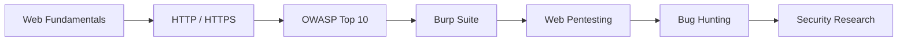

# 👋 Hey, I'm Roein Yousefi


<p align="center">
  
  
  
</p>

---

## 🧑‍💻 About Me

I'm **Roein**, a Backend Developer with a strong focus on building reliable and scalable web applications.

My main stack revolves around **Python, Django and Django REST Framework**, while I'm also exploring **Golang** and modern software architecture.

Alongside backend development, I've been diving deeper into **Cyber Security**, especially web application security, penetration testing and vulnerability research.

I enjoy understanding how systems work — and more importantly, **how they can be built better and secured properly.**

```text
Backend Development       ███████████████████░░   Django / DRF / Python
API Development           ██████████████████░░░   REST / Authentication
Database Engineering      ████████████████░░░░░   SQL
Cyber Security            ██████████████░░░░░░░   Web Security / Pentesting
Linux & Security Tools    █████████████░░░░░░░░   Fedora / Kali / Nmap / Burp
Golang                    ██████████░░░░░░░░░░░░   Learning & Building
```

---

## ⚡ Tech Stack

### Backend

<p>
  
</p>

### Databases & Infrastructure

<p>
  
</p>

### Security & Development Tools

<p>
  
</p>

**Security Tools & Technologies**

`Burp Suite` • `Caido` • `Nmap` • `WhatWeb` • `OWASP` • `WebGoat` • `OWASP Juice Shop`

---

## 🛡️ Cyber Security

Currently expanding my knowledge in **Web Application Security** and offensive security.

My security learning path includes:

* 🔐 Web Application Penetration Testing
* 🌐 HTTP / HTTPS & Web Architecture
* 🧪 Burp Suite & Web Security Testing
* 🕵️ Reconnaissance & Information Gathering
* 💉 SQL Injection
* 🔗 IDOR / Access Control
* 🧩 Authentication & Session Security
* ⚡ Command Injection
* 🖥️ Server-Side Vulnerabilities
* 🧱 OWASP Top 10
* 🧪 PortSwigger Web Security Academy
* 🐐 OWASP WebGoat
* 🛒 OWASP Juice Shop

> **Build it. Break it. Understand it. Secure it.**

---

## 🚀 Featured Projects

### 🛍️ Online Shop

A full-stack e-commerce project built around Django, with an interactive frontend and custom visual experience.

**Stack**

`Python` `Django` `JavaScript` `HTML` `CSS` `Docker`

🔗 **Repository:**
https://github.com/Roein-yousefi/online-shop

---

### 🌐 Team Website

A collaborative web platform featuring team-oriented functionality, user interaction and a dynamic shopping cart system.

**Stack**

`Python` `Django` `JavaScript` `Bootstrap` `Docker`

🔗 **Repository:**
https://github.com/Roein-yousefi/team_website

---

### 🔐 Advanced Programming

An API-focused project involving user management, authentication, OTP-based login and additional application logic.

**Stack**

`Python`

🔗 **Repository:**
https://github.com/Roein-yousefi/advanced-programming

---

## 🧠 What I'm Working On

```text
┌──────────────────────────────────────────────────────────────┐
│                                                              │
│   🔥 Backend Engineering                                    │
│      └── Django / DRF / REST APIs                            │
│                                                              │
│   🛡️ Cyber Security                                         │
│      └── Web Pentesting / OWASP / Bug Hunting                │
│                                                              │
│   🐹 Golang                                                  │
│      └── Exploring Go for backend systems                    │
│                                                              │
│   🐧 Linux                                                   │
│      └── Security labs / tooling / automation                │
│                                                              │
│   🚀 Startup                                                   │
│      └── Turning ideas into real products                    │
│                                                              │
└──────────────────────────────────────────────────────────────┘
```

---

## 📚 Currently Learning

<p align="center">
  
</p>

### Security Roadmap



---

## 📊 GitHub Activity

<p align="center">
  
  
</p>

<p align="center">
  
</p>

---

## 🐍 Contribution Activity

<p align="center">
  
</p>

---

## 🎯 Interests

```text
Backend Development       ████████████████████
Cyber Security            ███████████████████░
Web Application Security  ██████████████████░░
API Engineering           ██████████████████░░
Linux                     ████████████████░░░░
DevOps                    ██████████████░░░░░░
Cloud                     ████████████░░░░░░░░
Open Source               ███████████░░░░░░░░░
```

---

## 🤝 Let's Connect

<p align="center">
  <a href="https://www.linkedin.com/in/roein-yousefi-b794b0292/">
    
  </a>
  <a href="https://github.com/Roein-Yousefi">
    
  </a>
</p>

---

<h3 align="center">

> 💻 Code with purpose
> 🛡️ Learn how systems break
> 🚀 Build something worth protecting

</h3>

<p align="center">
  
</p>
